# NICAR 2016 - Creating Google Earth Pro flythroughs

**Table of contents**

1. [What is a flythrough?](#what-is-a-flythrough)
2. [Where they work well](#where-they-work-well)
3. [Getting started](#getting-started)
4. [Creating your own tours](#creating-your-own-tours)
5. [Creating a video file](#creating-a-video-file)
6. [Resources](#resources)

## What is a flythrough?
### Examples of flythroughs in use

The following sites show examples of Google Earth flythroughs or flythroughs created in a similar manner from satellite imagery and a moving camera to tell a story.

They show a range of styles, from simple video exported using Google Earth Pro with added labels and a simple voiceover, to more immersive slideshows including additional footage, photography and the ability to explore a story step-by-step.

- [BBC News – Paris attacks coverage](http://www.bbc.co.uk/news/world-europe-34818994)
- [New York Times – Trayvon Martin timeline](http://www.nytimes.com/interactive/2012/04/02/us/the-events-leading-to-the-shooting-of-trayvon-martin.html)
- [New York Times – Israeli and Palestinian violence explainer](http://www.nytimes.com/interactive/2016/02/14/world/middleeast/east-jerusalem-map.html)

## Where they work well
For this technique we’ll be making the most of the terrain data and 3D cities in Google Earth, so anywhere particularly hilly or urban tends to be the most effective. 3D buildings are available in a lot of major cities, so it’s worth turning them on to enhance your imagery.

The effect for both terrain and 3D buildings is quite impressive.

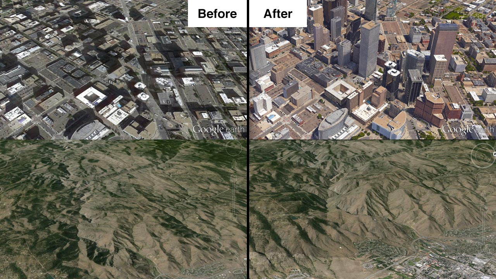

## Getting started
### Downloading Google Earth Pro
Google Earth Pro [can be downloaded from their site](http://www.google.co.uk/earth/download/gep/agree.html) and since [January 2015](https://google-latlong.blogspot.co.uk/2015/01/google-earth-pro-is-now-free.html) hasn’t required a paid license, making it perfect for teams of newsroom journalists and designers to create content.

Once you have installed it, open it up and log in with the following settings:
*Username:* _[your email address]_
*License key:* GEPFREE

### The interface
If you have used Google Earth before, it is likely that you already know enough about the interface to create a flythrough.

As a bit of a refresher, or if you’re new to Google Earth, here are the tools we’ll be using:

**Navigating around the map**

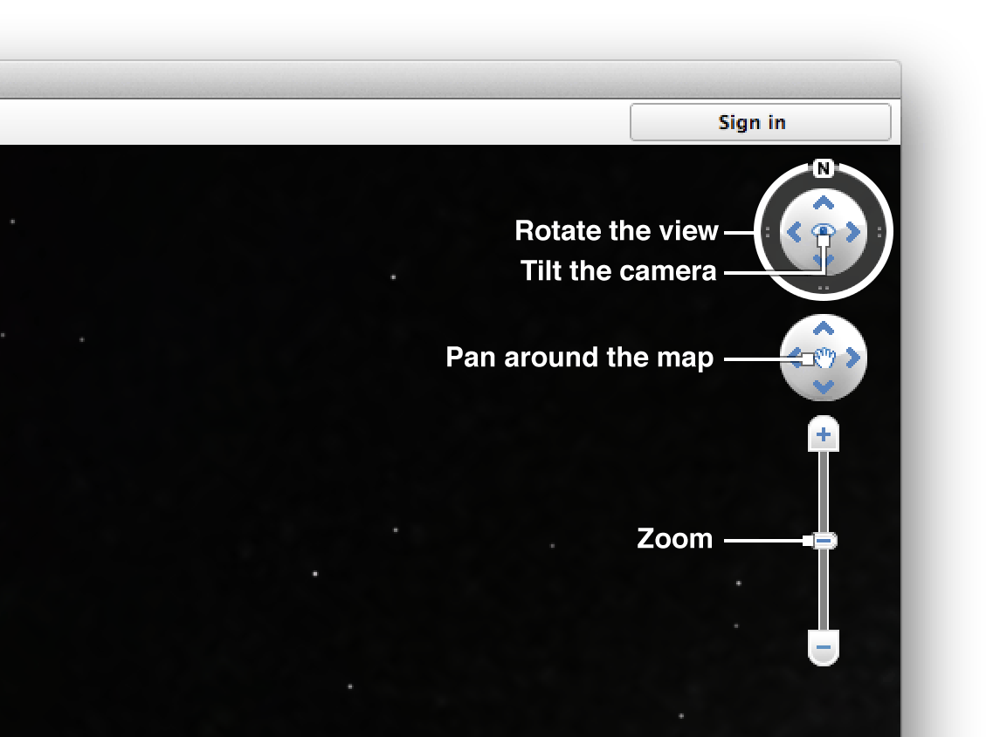

**Creating and arranging markers**

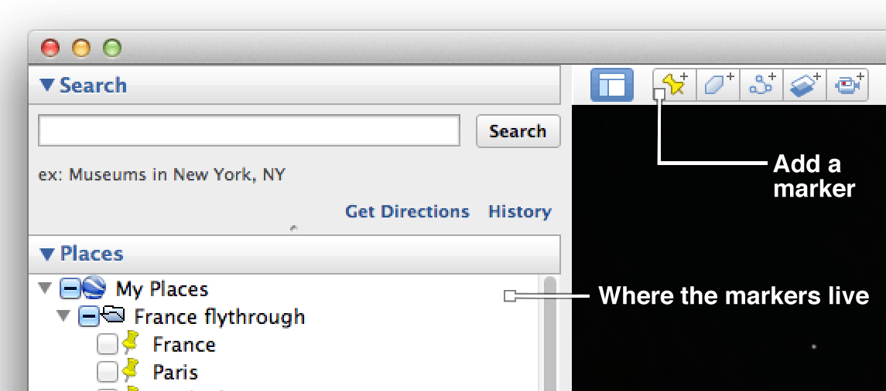

In addition to these, there are a couple of handy keyboard shortcuts that make navigating around a location easier:

  - **Resetting the view:** If at any point you want to reset the view to looking directly down at the Earth with the top of the screen facing north, you can press *r* on the keyboard to reset the view.

  - **Tilting the view** Most of the movement around in this software is based on clicking and dragging with the mouse. If you hold the *shift* key while you click and drag, you can adjust the tilt of the camera if for example you want to look at a certain feature from a shallower angle. (You can also tilt and pan the camera by clicking the arrows if you prefer)

## Creating your own tours
Tours are the mechanism behind successful flythroughs. While there is a tool in Google Earth Pro to record a tour from a series of panning, tilting and rotating movements made with the mouse, we have found that creating tours from a series of markers is smoother, easier to adjust and gives professional results.
	
### Using a series of markers
**Step 1 - Create a folder:**
This is where we will keep all our markers and eventually use to produce the final tour. To add a folder, go to the main menu, select ‘Add’ and then ‘Folder’

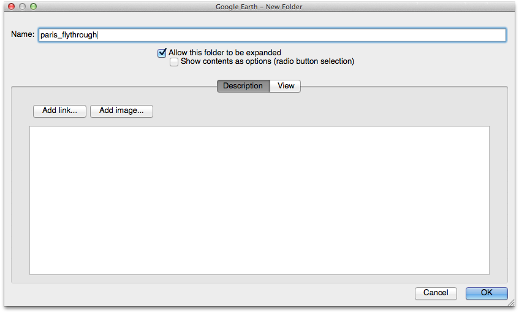

Give it a name and click ‘OK’ and it should appear in the list of places on the left hand side.

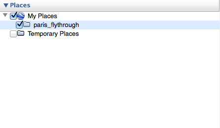

**Step 2 - Framing your first shot:**
Imagine you’re directing a film with a series of scenes. Each scene is a location that you want to show to the viewer and the flythrough is the complete film. It’s your job to frame each scene, and then Google Earth fills in the gaps between shots.

Navigate to the first location that you want to show, use the navigation tools to zoom, rotate and tilt until you’re happy with the composition. Then go to the row of icons at the top of the window and click the ‘Add marker’ button.

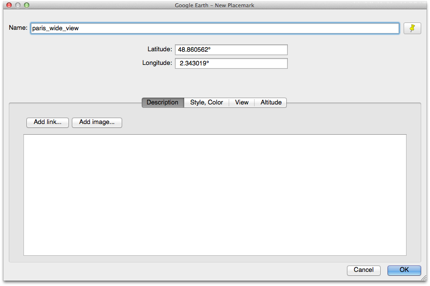

As we did with the folder, give it a name, click OK and it should appear in the list of places. If it’s not inside the folder, you can drag it so that it sits inside.

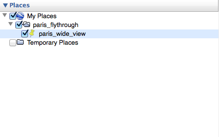

This helps keep everything in the same place and will help later on when we’re preparing to render the final video. You can also untick the checkbox next to the marker name to hide it on the map. It will still work as a location for the flythrough, but by hiding it we’ll make sure that it won’t show up as a bright yellow marker on your video.

 **Step 3 - Repeat this process for each place you want to show:**
Keep creating markers in the same way for each location in the flythrough. If you want to change the order of places you can drag them up and down in the folder, and if there are any shots you’re not completely happy with you can delete the marker and create new ones until you’re happy with the set. 

**Step 4 – Play the flythrough and check you’re happy with it**
To view your flythrough, select the folder in the ‘Places’ panel and a button with an illustration of a folder and a play button should appear below the ‘Places’ panel. Click this, and your flythrough will start to play back. 

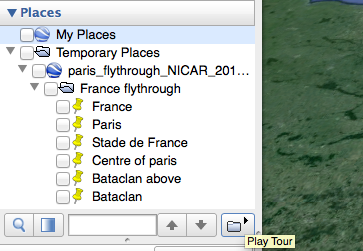

Chances are that you will want to change the speed that it plays back at. To do this, go into the main Google Earth Pro settings (Tools > Options on Windows, Google Earth Pro > Preferences on OS X) and select ‘Touring’. With the first two sliders you can adjust the speed that your flythrough plays. The first slider controls the amount of time it takes to get from place to place (we’d recommend about 3 seconds) and the second slider controls how long the flythrough will pause at each location.

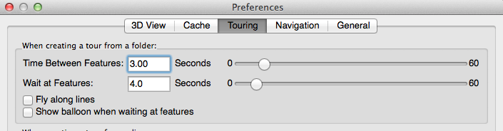

If at the end of this process you are planning on editing the footage with other software packages to add a soundtrack or cutting it with video from elsewhere, you may find it useful to increase the amount of time at each location to give yourself a larger margin for error when editing.

**Step 5 – Save KML before rendering**

Once you’ve done all this, it’s a good idea to save all your hard work. To do this, right click (ctrl + click on a Mac) your folder and select ‘Save place as’. Give the file a name, choose KML as the file type and save.

This file can act as a backup in case you make any changes to markers and want to go back, or can also be sent to others for them to open in their own copy of the software to view the steps of your flythrough. We’ve found this technique to be useful in the past when one member of the team has composed each shot on their personal laptop but we wanted to transfer the markers to a more powerful computer for rendering.

**Step 6 – Create a tour from a folder of markers**

To turn these markers into something we can use to render video, we need to save a tour. When you click the play folder button (from step 5) a set of playback controls appears in the bottom left of the map window.

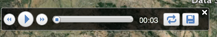

Click the save icon on the right hand side, give the tour a relevant name (as we will be using this later) and click OK. You should then see a new item in your folder with a little video camera icon – this is a tour.

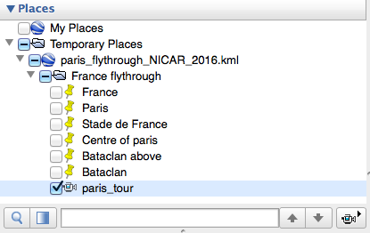

## Creating a video file
To create a video file from a tour, we take the tour that we created and use Google Earth Pro’s ‘Movie Maker’ tool. Before that, however, it’s worth maxing out the settings to keep our renders nice and smooth.

### Preparing for rendering
**Updating cache settings:** To begin with, it’s worth setting the cache to the maximum possible size. Go into the Google Earth settings (Tools > Options on Windows, Google Earth Pro > Preferences on OS X) and select the ‘cache tab’. Enter **1024** for the Memory Cache Size and **2048** for the Disk Cache Size.

**Play through your tour: ** This helps to preload the imagery and download the relevant data for the location of your flythrough rather than downloading while rendering. Double click your tour in the ‘Places’ panel and let it run through a couple of times.

### Rendering
To begin rendering, make sure that the tour playback controls (from step 6 of creating the tour) are closed by clicking the cross in the top right hand corner.

Then go to Tools in the menu and select ‘Movie maker’. In the first window that appears, you should select ‘A saved tour’ to record from, and pick the tour file that you just created from the dropdown list. You can also set the framerate and resolution for your video (we use 1920x1080 HD at 25FPS, but if in doubt it’s worth asking someone who works with video in your newsroom). Click the ‘Browse’ button to pick a location to save the video file, give it a name and hit ‘Create Movie’.

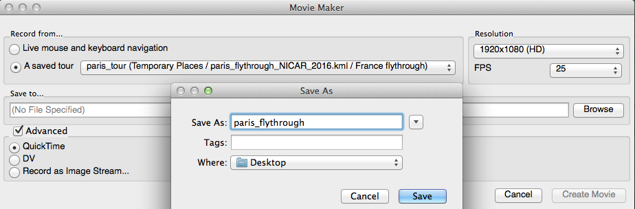

You will then see a window for compression settings. As before, it’s worth checking the format that your team require video to be supplied in, but a useful compression format for online is H.264. Make sure that ‘Frames per second’ is set to the required value (25 in our case) and that the quality is set to Best.

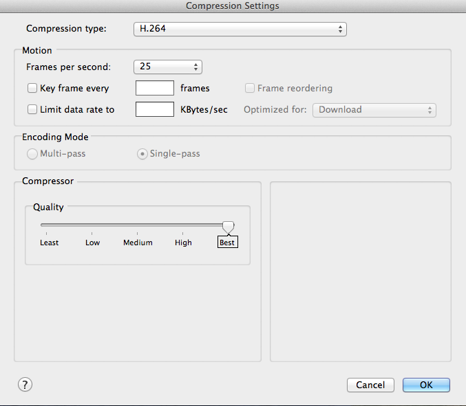

Click OK and you will start rendering. This process will play through your tour in the background with a progress bar on top. If it looks like the tour has stopped, this is because Google Earth needs to render multiple frames for each location you have stopped at, so it is likely to be rendering a pause in the tour. 

### Rendering trouble?
If you’re having problems with your renders – be that 3D imagery dropout, stuttering renders or low resolution satellite imagery – there is likely to be a solution for it.

**Low resolution imagery:** If the satellite imagery in the area of your flythrough is appearing pixelated or low-resolution, it could be that your connection to Google’s server isn’t quite working. We recommend using the fastest internet connection that you can get your hands on (often a cabled ethernet connection rather than WiFi).

**3D imagery dropout:** Sometimes a flythrough moves over an area before the software has had time to render all the 3D buildings or terrain. We’ve found that playing back the tour a couple of times before your record it can help to counter this.

**General advice:** Clearing Google Earth’s cache and reloading the imagery for your tour gives you the best chance of success, Google’s [instructions for rendering imagery](https://newslab.withgoogle.com/lesson/5225220302438400) cover how to do this in detail for both Windows and Mac devices.

## Resources
- [Google Journalism tools walkthrough](https://newslab.withgoogle.com/lesson/5877564899852288)
- [Google Journalism tools rendering tips](https://newslab.withgoogle.com/lesson/5225220302438400)