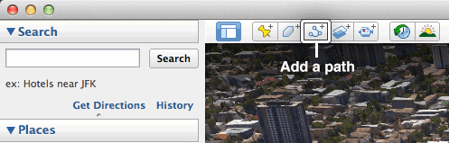
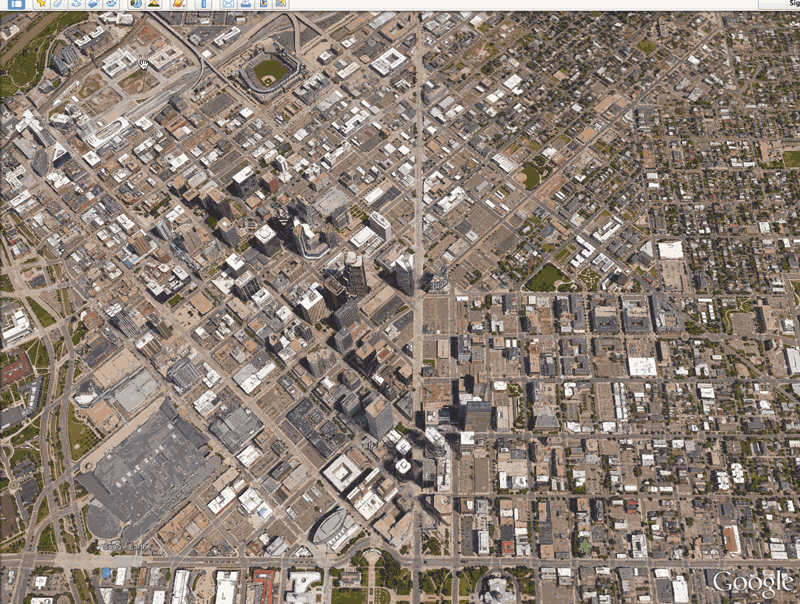
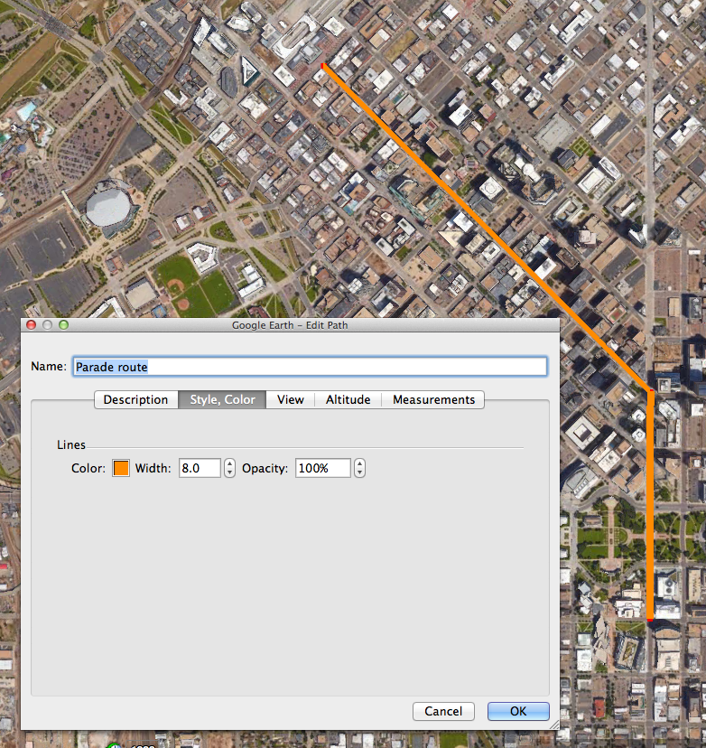
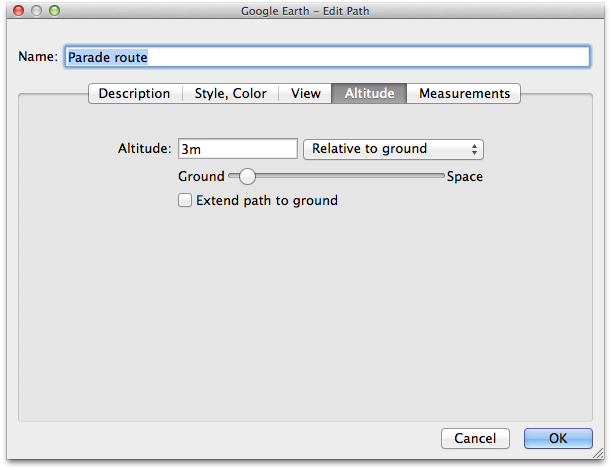
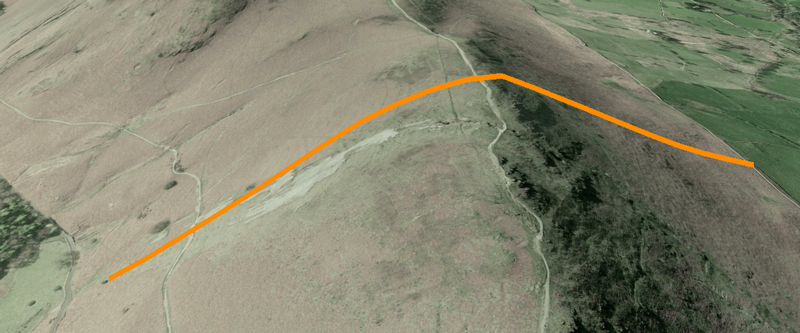
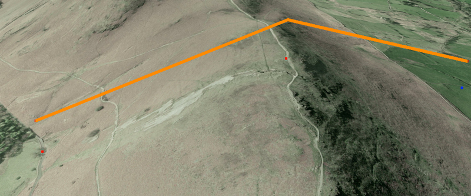
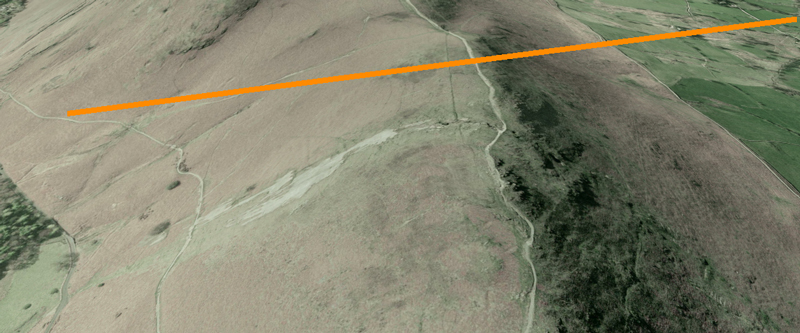
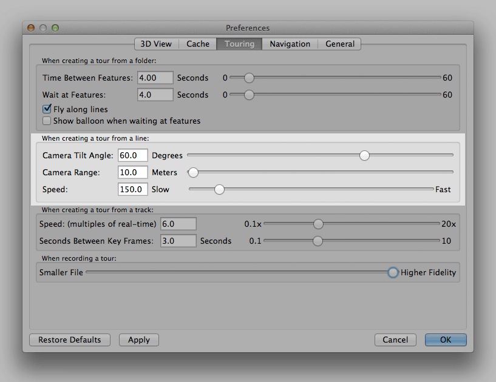
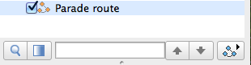

# Creating a Google Earth flythrough from a path

← [Back to main guidelines](../../../)

Generally we’ve found that [using a series of markers](../../../#using-a-series-of-markers) is the most versatile technique for the majority of news stories, but if you have a story that revolves around a specific path, road or track then it may be useful to create a flythrough using a path.

If you are interested in [creating flythroughs from a combination of markers and paths](#advanced-techniques-mixing-markers-and-points-to-create-a-tour), we have added quick instructions for this towards the end of this guide.

We would recommend, however, that you have a read through this guide and the original method of creating a flythrough [Using a series of markers](../../../#using-a-series-of-markers) before you dive straight in to combining techniques.

**Table of contents**

1. [Creating the path](#creating-the-path)
2. [Visible vs. invisible paths](#visible-vs-invisible-paths)
3. [Setting the altitude](#setting-the-altitude)
4. [Adjusting flythrough settings](#adjusting-flythrough-settings)
5. [Creating the tour](#creating-the-tour)
6. [Rendering video](#rendering-video)
7. [Advanced techniques: Mixing markers and points to create a tour](#advanced-techniques-mixing-markers-and-points-to-create-a-tour)

## Creating the path
To create a path to fly along, use the ‘Add Path’ tool in the row of icons at the top of the window.

Click this and a window will appear, much like the one that appears when adding a marker. Give it a relevant name, but **don’t click OK yet**. The difference in this case is that you want to keep the window open as you can only add to or edit the points on a path when this window is open.

Move the window to the side, and then click in each location on the map that you want to place a point on the path.

Don’t worry if the path is quite angular, Google Earth will smooth out the corners when it is flying over the path. We’ve found that we get smoother footage by using fewer points and creating an angular path that will be automatically smoothed out when flying along than to try and draw more detailed curved paths with a higher number of points.

Once you’re happy with your path, click OK and it will be added to the ‘Places’ panel on the left of the interface.

## Visible vs. invisible paths

**Visible paths**

To change the appearance of a path, there is a ‘Style, Color’ tab in the settings window that appears when you first create the path. If you want to edit the appearance of an existing path, select it in the ‘Places’ panel and then choose Edit > Get Info (or Edit > Preferences on a Windows PC).

From here, you can adjust the width, colour and opacity of the path.  As you change the settings, the path will change in the main Google Earth window so that you can see the effects of the changes.

On some devices we have occasionally found that a visible path might intersect with the ground causing parts of it to disappear underneath. To counter this, we’ve found that giving the path an altitude of 1 or 2 metres relative to the ground is subtle enough to counter this (see: [Setting the altitude](#setting-the-altitude))

**Invisible paths**

If you don’t want to display the path you can uncheck it in the ‘Places’ panel and it will still be treated as the track along which a camera will move in a flythrough.

## Setting the altitude

An added feature of paths is that they don’t have to run along the ground.

If you have data for something like the flight path of a plane there is a chance that your path will already contain some altitude data, but if you want to take a path you have personally created and adjust the altitude you can do this in the path’s settings.

To do this, select the path in the ‘Places’ panel and then choose Edit > Get Info (or Edit > Preferences on a Windows PC) and select the ‘Altitude’ tab.

There are a range of altitude types, including ‘clamped to ground’, ‘relative to ground’ and ‘absolute’ – each of which can be useful at different times.

**Clamped to ground** keeps the path locked to the ground, following the elevation of terrain data [if you have that layer turned on](../../../#using-3D-buildings-and-terrain-data).

**Relative to ground** takes the path and raises each point up by the chosen altitude. It’s worth noting that this option doesn’t follow the elevation of the terrain below, just moves the individual points you defined when creating the path by a set distance.

**Absolute** is useful when you know an exact height above sea level that you want to use. If your path disappears when choosing this option, make sure that your chosen altitude is higher than the surrounding terrain, as it may (correctly) be rendered underground.

## Adjusting flythrough settings
- Go into the Google Earth settings (Google Earth menu > Preferences on a Mac, Tools > Options on a PC)
- Select the ‘Touring’ tab
- Adjust the ‘When creating a tour from a line’ sliders to control the speed of travel and camera position

### Adjusting the camera
Adjusting the camera position is a case of tweaking the settings depending on whether you want to closely follow at path level or take a more distant overview.

The first of the camera controls adjusts the angle between the camera and the vertical axis where 0 is looking straight down and 89 is looking horizontally. We’ve found that an angle of about 60-70° works quite nicely for most paths as it gives an overview of the surrounding area and allows you to see the course of the path itself.

The second control adjusts the distance between the lens of the camera and the path (once the angle of the camera has been taken into consideration), with 0 being locked to the path to a maximum of 5,000 metres away.

The following diagram shows how angle and range combine to change the camera position as a relative distance from the path, rather than setting an absolute altitude.

(For those of you who are mathematically-inclined, absolute altitude above the path can be calculated as range × sin(90 - angle)

## Creating the tour

To create a tour item so that we can render a video of the flythrough, select the path in the ‘Places’ panel and a button with the path icon and a play button should appear below the panel. 

Click this, and your flythrough will start to play back with a set of playback controls in the bottom left corner of the window.

Click the save icon on the right hand side, give the tour a relevant name (as we will be using this later in the rendering process) and click OK. You should then see a new item in your folder with a little video camera icon – this is a tour.

## Rendering video
Once you have [created a tour](#creating-the-tour), you can use the [rendering instructions from the main section of the guide](../../../#creating-a-video-file) to export a video of your flythrough.

## Advanced techniques: Mixing markers and points to create a tour
If you have a more complex story that involves both a path and a series of other locations, you can use a combination of these to create a more intricate flythrough.

### Setting up
- Go into the Google Earth settings (Google Earth menu > Preferences on a Mac, Tools > Options on a PC)
- Select the ‘Touring’ tab
- Make sure that ‘Fly along lines’ is checked in the ‘Creating a tour from a folder’ section

If you haven’t already, you can also adjust the settings for [flying between points](../../../#adjusting-the-speed-and-pace-of-playback) and [flying along lines](#adjusting-the-camera).

### Arranging your items
In the same way that we used a folder to [create a flythrough from a series of markers](../../../#using-a-series-of-markers), we need to use a folder to hold everything together.

To add a folder, go to the main menu, select ‘Add’ and then ‘Folder’

Give it a name and click ‘OK’ and it should appear in the list of places on the left hand side.

You should then place all your markers and paths in the folder in the order that you would like them to progress.

Once everything is arranged correctly, you can follow the instructions from step 4 of [Using a series of markers](../../../#using-a-series-of-markers) to create the tour and render it as a video.